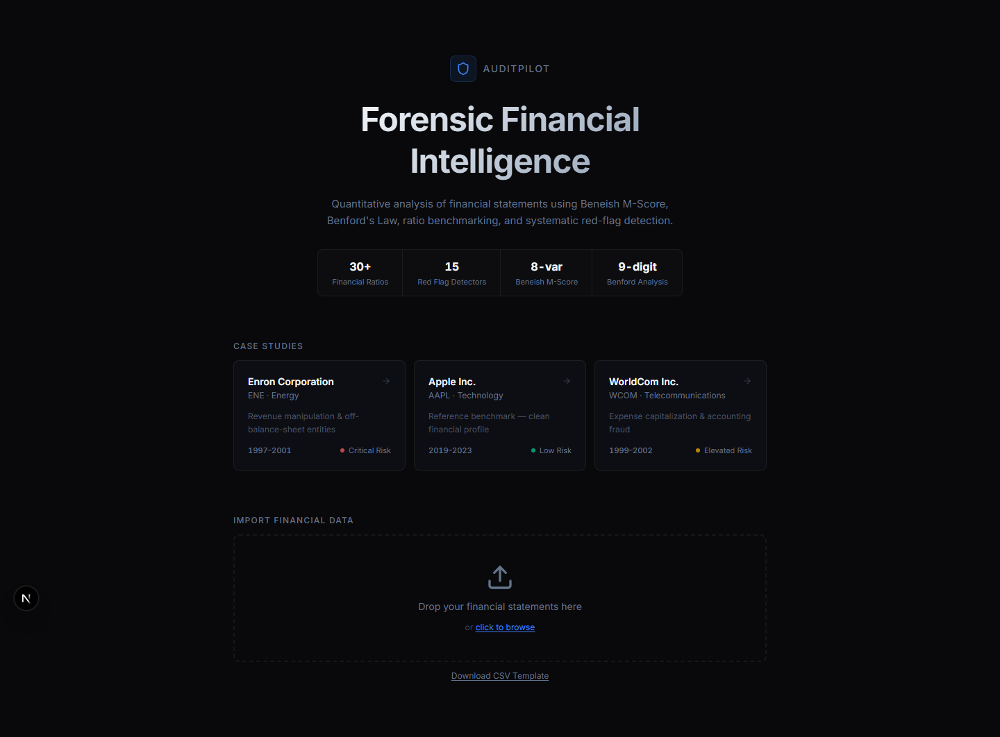
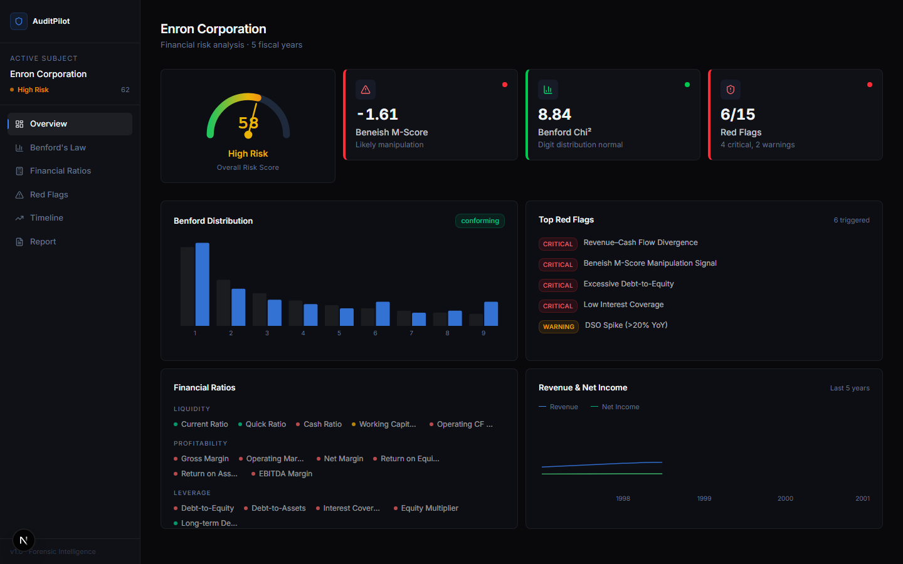
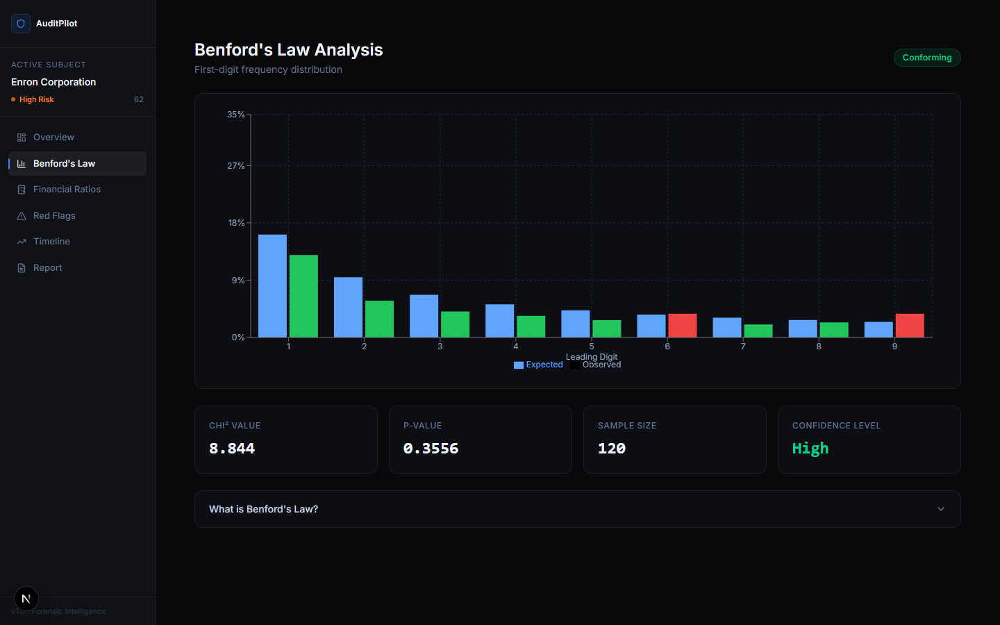
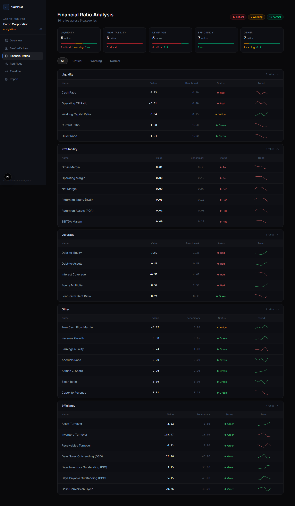
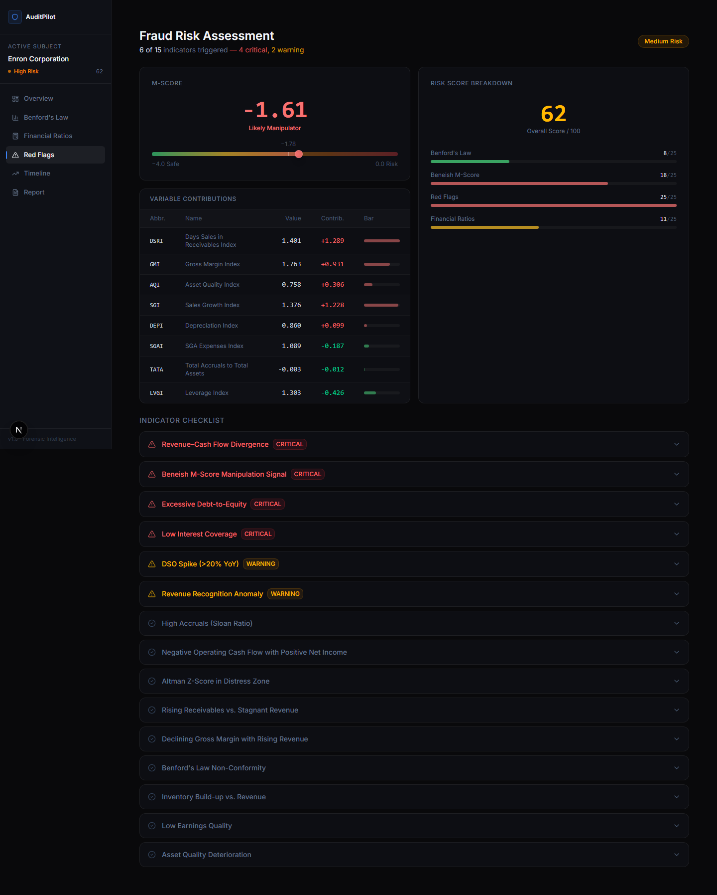
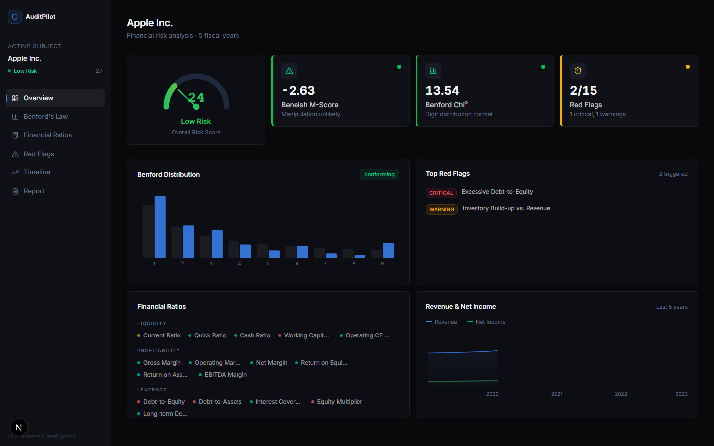

# AuditPilot

**Forensic Financial Intelligence**

AuditPilot is a forensic accounting platform that detects earnings manipulation in corporate financial statements. It applies Benford's Law, the Beneish M-Score (8-variable model), 30 financial ratios, and 15 red-flag indicators to produce a comprehensive fraud risk assessment. All core analysis runs client-side — no backend required.

---

## Screenshots

| Landing                                | Dashboard (Enron)                                |
| -------------------------------------- | ------------------------------------------------ |
|  |  |

| Benford's Law                          | Financial Ratios                     |
| -------------------------------------- | ------------------------------------ |
|  |  |

| Fraud Risk Assessment                     | Dashboard (Apple — Clean)                    |
| ----------------------------------------- | -------------------------------------------- |
|  |  |

---

## Features

- **Benford's Law Analysis** — First-digit frequency test with chi-squared significance testing
- **Beneish M-Score** — 8-variable model for detecting earnings manipulation (DSRI, GMI, AQI, SGI, DEPI, SGAI, TATA, LVGI)
- **30 Financial Ratios** — Liquidity, profitability, leverage, efficiency, and quality metrics with sector benchmarks and sparkline trends
- **15 Red Flag Indicators** — Automated detection of revenue/cash flow divergence, accruals anomalies, DSO spikes, and more
- **AI Audit Report** — LLM-generated forensic audit memo via OpenRouter
- **Trend Analysis** — Multi-metric normalized timeline with statistical outlier detection
- **Pre-loaded Case Studies** — Enron (1997-2001), Apple (2019-2023), WorldCom (1999-2002)
- **CSV Upload** — Analyze any company with custom financial data

---

## Tech Stack

- **Framework:** Next.js 14 (App Router)
- **Language:** TypeScript
- **Styling:** Tailwind CSS v4
- **Charts:** Recharts
- **Statistics:** jStat (chi-squared distribution)
- **AI:** OpenRouter API (Claude)
- **Icons:** Lucide React

---

## Quick Start

```bash
git clone https://github.com/NWichter-NeoTube/auditpilot.git
cd auditpilot
npm install
npm run dev
```

Open [http://localhost:3000](http://localhost:3000) and select **Enron Corporation** to see the fraud detection in action.

---

## Environment Setup

Create a `.env.local` file for the optional AI report feature:

```env
OPENROUTER_API_KEY=your_key_here
```

All core analysis (Benford, Beneish, Ratios, Red Flags) works without an API key. The AI report feature requires an [OpenRouter](https://openrouter.ai) key.

---

## License

MIT

---

_Built for the Octoverse Hackathon 2026_
